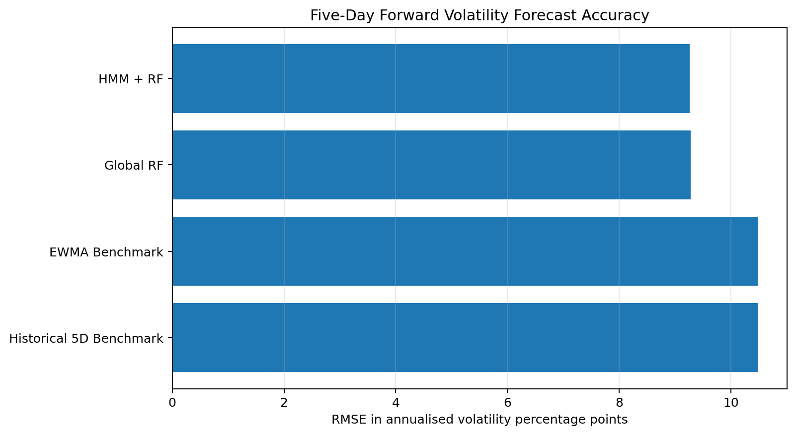
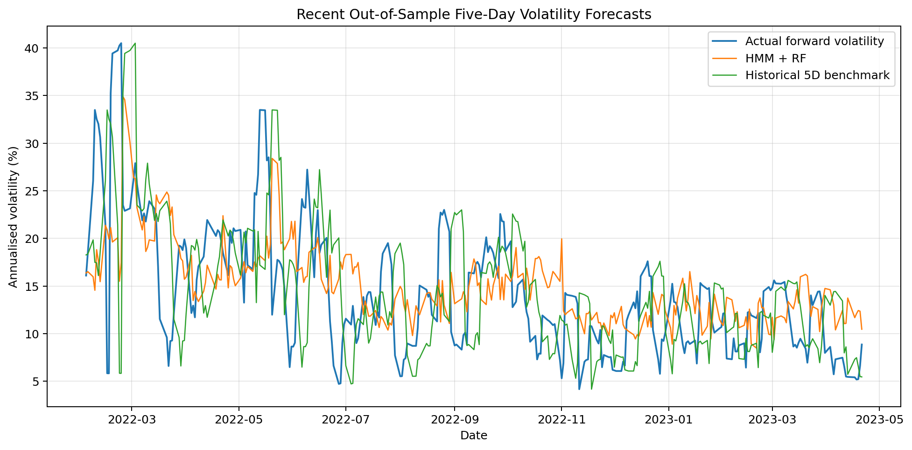

# HMM Regime-Aware Volatility Forecasting

A beginner-friendly quantitative-finance project that combines a hidden Markov
model with regime-specific random forests to forecast **five-day forward realised
volatility** for the NIFTY 50.

The HMM is implemented from scratch using the forward-backward and Baum-Welch
algorithms. The project uses a chronological train/test split and compares the
forecast with simple volatility benchmarks.

## Project objective

The original version predicted tomorrow's updated 20-day rolling volatility.
That target was highly persistent because consecutive rolling windows shared 19
of their 20 returns.

This version predicts the volatility actually realised over the **next five
trading days**:

```math
RV^{(5)}_{t+1,\ldots,t+5}
=
100\sqrt{
\frac{252}{5}
\sum_{i=1}^{5} r_{t+i}^{2}
}
```


None of the returns in this target is known at prediction time, making it a
genuine forward-looking forecasting problem.

## Methodology

### 1. Volatility regimes

A two-state HMM is fitted to exponentially weighted volatility. Within each
hidden state,

$$
\log \sigma_t^{EWMA}
\mid z_t=j
\sim
\mathcal{N}(\mu_j,s_j^2).
$$

This implies positive, lognormally distributed volatility within each regime.

The states are interpreted as:

- **State 0:** low-volatility regime
- **State 1:** high-volatility regime

The state probabilities are filtered causally, so the classification on date
$t$ uses only information available up to that date.

### 2. Random-forest forecasts

A separate random forest is trained within each HMM regime using:

- EWMA volatility
- Historical five-day realised volatility
- Historical 20-day realised volatility
- Today's absolute return

The target is the annualised realised volatility over the following five
trading days.

### 3. Benchmarks

The model is compared with:

- a global random forest without regime separation;
- historical five-day realised volatility;
- EWMA volatility.

## Results



### Full out-of-sample test

| Model                   |    RMSE |    MAE |     R2 | RMSE improvement vs historical benchmark (%)   |
|:------------------------|--------:|-------:|-------:|:-----------------------------------------------|
| HMM + RF                |  9.257  | 5.9136 | 0.4318 | 11.69%                                         |
| Global RF               |  9.2784 | 5.9166 | 0.4291 | 11.49%                                         |
| EWMA Benchmark          | 10.4758 | 6.523  | 0.2723 | 0.06%                                          |
| Historical 5D Benchmark | 10.4825 | 6.9731 | 0.2714 | 0.00%                                          |

The HMM + RF model achieved the lowest overall RMSE:

- **RMSE:** 9.2570
- **MAE:** 5.9136
- **R²:** 0.4318
- **RMSE improvement over the historical five-day benchmark:** 11.69%

It also improved RMSE by approximately **11.63%**
relative to the EWMA benchmark.

### Does the HMM add value over a global random forest?

Only slightly in the full daily evaluation:

- HMM + RF RMSE: **9.2570**
- Global RF RMSE: **9.2784**
- Relative HMM advantage: **0.23%**

Therefore, the regime structure may add a small benefit, but the difference is
too small to claim that the HMM decisively outperforms the global random forest.

### Non-overlapping weekly check

Daily five-day targets overlap. The following table evaluates every fifth
forecast origin so the target windows do not overlap:

| Model                   |   Observations |    RMSE |    MAE |     R2 |
|:------------------------|---------------:|--------:|-------:|-------:|
| Global RF               |            228 |  8.6059 | 5.8238 | 0.5029 |
| HMM + RF                |            228 |  8.6131 | 5.7944 | 0.5021 |
| Historical 5D Benchmark |            228 |  9.4629 | 6.7141 | 0.399  |
| EWMA Benchmark          |            228 | 10.1721 | 6.4771 | 0.3055 |

The HMM + RF still beats the historical benchmark by **8.98%**
in RMSE. The global RF is marginally better than HMM + RF in this smaller
non-overlapping sample:

- Global RF RMSE: **8.6059**
- HMM + RF RMSE: **8.6131**

This supports a cautious conclusion: the predictors clearly improve volatility
forecasting, while the incremental gain from regime separation is modest.

### Performance by regime

| Regime | HMM + RF RMSE | Historical benchmark RMSE | Improvement |
|---|---:|---:|---:|
| Low volatility | 7.3326 | 8.0172 | 8.54% |
| High volatility | 13.3568 | 15.5669 | 14.20% |

The largest improvement occurs in the high-volatility regime, where the model
reduces RMSE by approximately **14.20%**.

## HMM regime estimates

|   State | Interpretation   | Mean EWMA volatility (%)   |   Persistence |   Expected duration (days) |
|--------:|:-----------------|:---------------------------|--------------:|---------------------------:|
|       0 | Low volatility   | 13.54%                     |        0.9959 |                      246.6 |
|       1 | High volatility  | 31.51%                     |        0.9906 |                      106.5 |

The two states are clearly separated:

- low-state mean EWMA volatility: approximately **13.54%**;
- high-state mean EWMA volatility: approximately **31.51%**.

Both states are highly persistent, producing stable market-regime periods rather
than rapid day-to-day switching.

## Feature importance

| Feature               |   High volatility |   Low volatility |
|:----------------------|------------------:|-----------------:|
| Absolute Return (%)   |             0.091 |            0.162 |
| EWMA Volatility (%)   |             0.331 |            0.301 |
| Historical RV 20D (%) |             0.273 |            0.331 |
| Historical RV 5D (%)  |             0.305 |            0.206 |

Longer-horizon historical volatility and EWMA volatility are the most important
predictors. Today's absolute return contributes less, particularly within the
high-volatility state.

## Example forecasts



The model captures broad movements in future volatility but, like most
tree-based point forecasts, tends to smooth the most extreme volatility spikes.

## Repository structure

```text
.
├── HMM_Forward_5Day_Realized_Volatility.ipynb
├── nifty50_prices.csv
├── outputs_forward_5day_volatility/
│   ├── feature_importance.csv
│   ├── forecast_results.csv
│   ├── hmm_state_summary.csv
│   ├── non_overlapping_results.csv
│   ├── regime_results.csv
│   └── test_predictions.csv
├── docs/
│   └── assets/
│       ├── forecast_rmse_comparison.png
│       └── recent_forecasts.png
├── requirements.txt
├── .gitignore
└── README.md
```

## Installation

Create and activate a Conda environment:

```bash
conda create -n hmm-volatility python=3.12 -y
conda activate hmm-volatility
```

Install the packages:

```bash
pip install numpy pandas scipy scikit-learn matplotlib yfinance jupyter
```

## Running the project

Keep `nifty50_prices.csv` in the same folder as the notebook, then run:

```bash
jupyter lab
```

Open:

```text
HMM_Forward_5Day_Realized_Volatility.ipynb
```

Run all cells in order. The result tables will be written to:

```text
outputs_forward_5day_volatility/
```

## Main conclusion

The regime-aware model improves materially on historical and EWMA volatility
benchmarks when predicting five-day forward realised volatility.

However, the HMM + RF and global RF results are almost identical. The project
therefore supports two separate conclusions:

1. the forward-volatility features provide useful predictive information;
2. HMM regime separation is interpretable and may help slightly, but it is not
   proven to be essential for forecast accuracy.

This is an honest and useful result for a beginner quantitative-finance project.

## Limitations

- Only one equity index is studied.
- HMM parameters are estimated once rather than updated through walk-forward
  refitting.
- Daily five-day targets overlap, although a non-overlapping weekly check is
  included.
- Random-forest hyperparameters are fixed rather than extensively tuned.
- The model forecasts volatility, not market direction or trading returns.
- Yahoo Finance data are suitable for educational research, not production use.

## Author

**Fakhruddin Hussain**
